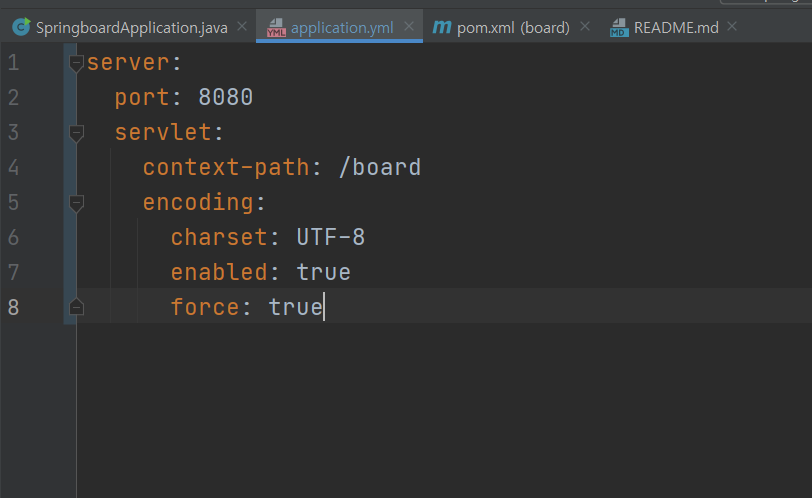

# 1. 스프링부트 프로젝트 설정하기 (.yml 야믈파일 설정)

## 야믈 파일이란? 
***
> - 스프링의 설정에 관한 파일들을 담고 있다.
> - 본래는 application.properties라는 이름으로 되어있지만 가독성이 떨어지는 관계로 yml파일이 생겨났다.(라고 대충 알고있음)
> - yml파일은 하위값이라면 라인을 바꿔서 아랫쪽으로 들여쓰며 작성하게 되어있다. 
> 
> 
>  이런식으로 작성되어 있으며 여기서 말하는 서버포트는 기본 톰캣을 구동했을때 톰캣이 가지고 있는 포트 번호이다.
>  그리고 그 밑에 servlet-context-path는 이 프로젝트가 타고 들어가는 주소를 설정해놓는 것으로
>  아무것도 정해놓지 않으면 http://localhost:8080/ 이런식으로 나오지만 
>  context-path를 위와같이 /board로 정해놓으면 http://localhost:8080/board/ 이 주소를 타고 
>  들어가게 된다.
> 
> 
*** 
> 이렇게 기본 설정은 대충 완료되었으므로 다음번에는    
> 위 설정을 바탕으로 기본 페이지에 Hello World를 찍어보도록 하겠다.
> 
## 다음시간에 할 내용 
 - index 페이지 만들어서 Hello World 찍어보기 
 - MySql에 스프링 연결할 yml파일 설정하기 

