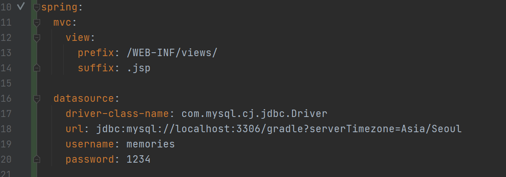
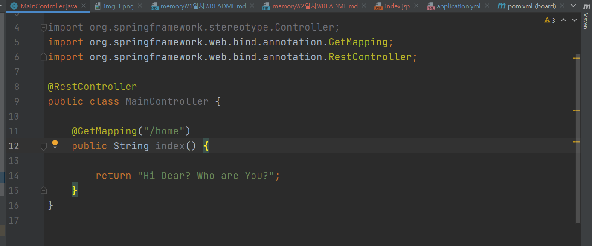
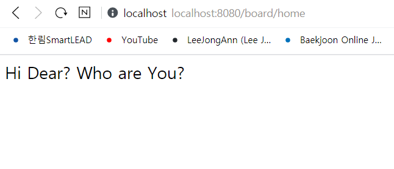

# 2. MySQL 서버와 관련된 yml파일 설정완료 및  문자열 찍어보기

> spring에서 바라보는 경로를 지정할 수 있는데 ,   
> prefix는 작업 파일의 경로를 항상 WEB-INF/views로 지정해놓는 것이다.   
> 또한 그 밑에 suffix는 작업파일의 이름 뒤에 붙일 확장자 명을 표시한 것이다.   
> .jsp라고 붙어 있는데 그러면 *항상 jsp 파일을 사용하게 된다.*

***   

   

어노테이션은 스프링에서 제공하는 다양한 기능을 편리하게 쓸 수 있다.

> 1. @RestController 어노테이션은 json을 반환하기 위해서 주로 사용한다.   
> 일단 뭐라도 찍어보기 위해서 사용했다.   
> 2. @GetMapping 어노테이션은 해당 컨트롤러에서 주소를 연결해주기 위해서 사용한다.   
> GetMapping 뒤에 home이라고 붙어있는데 http://localhost:8080/borad/home 이렇게 붙이면 
> 위와 같은 화면이 나타나게 된다. 그리고 리턴값이 문자열이기 때문에 다음과 같은 화면이 나타나게 된다.

***

   

***
package com.memories.UserController;

import org.springframework.stereotype.Controller;
import org.springframework.web.bind.annotation.GetMapping;
import org.springframework.web.bind.annotation.RestController;

@RestController
public class MainController {
    @GetMapping("/home")
    public String index() {
        return "Hi Dear? Who are You?";
    }
}

***