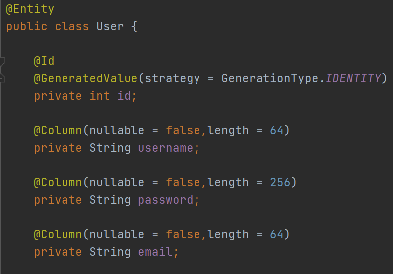
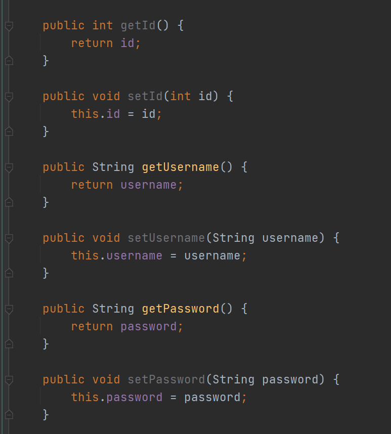
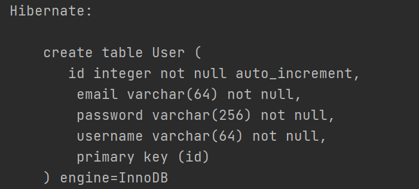
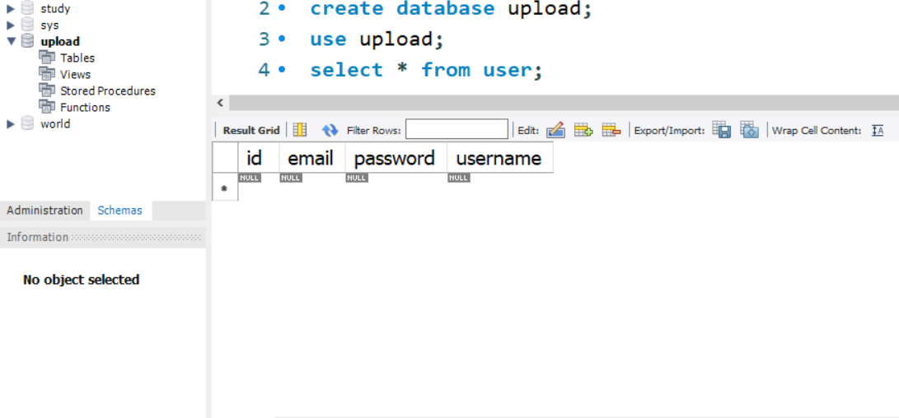
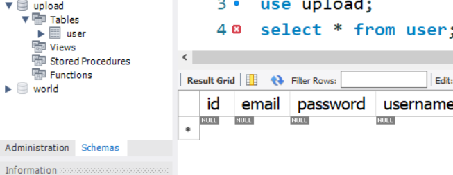

# 3.엔티티 클래스 작성 및 MySql 연동하기 
***

- @Entity 어노테이션은 엔티티 DB에 집어넣을 엔티티 클래스라고 선언하기 위한   
어노테이션이다. 
  이 어노테이션을 사용하면 DB에 User 테이블이 생성되게 된다.
  
- 

***

* Getter Setter는 메서드를 통해서 사용자로부터 입력값을 받고
DB에 저장하기 위해 생성한다.
  사실은 어노테이션을 선언해서 이런 겟셋메서드는 선언하지 않아도 된다.
  이 내용은 추후에 언급하도록 하겠다.

***

- 엔티티를 선언하고 ,야믈파일 설정까지 마친 후 
  스프링부트 앱을 실행하게 되면 , 다음과 같은 SQL문을 확인할 수 있게된다.
  
*User라는 테이블이 생성됬다는 것으로 밑에 그 속성들이 들어가 있다.
실제로 그 DB에 가서 확인해보면 아래와 같다.*

***

- DB명이 upload라고 설정되어있고 , 그 하위 테이블에는 실행전에 이런 모습이다
하지만 실행하고 난 후에 모습은 아래와 같다.

***

- Tables에 화살표가 뜨면서 User테이블이 생성됐다.
ID,Email,Password,username등등이 들어가 있는것을 확인할 수 있다.

### 이제 MySQL과 스프링부트의 연동이 끝이 났다.
### 다음 시간에는 테이블을 더 생성하고 테스트 해보는 작업을 진행해보겠다.

***
package com.memories.DataModel;

import lombok.AllArgsConstructor;
import lombok.Data;
import lombok.NoArgsConstructor;

import javax.persistence.*;

@Entity
public class User {

    @Id
    @GeneratedValue(strategy = GenerationType.IDENTITY)
    private int id;

    @Column(nullable = false,length = 64)
    private String username;

    @Column(nullable = false,length = 256)
    private String password;

    @Column(nullable = false,length = 64)
    private String email;

    public int getId() {
        return id;
    }

    public void setId(int id) {
        this.id = id;
    }

    public String getUsername() {
        return username;
    }

    public void setUsername(String username) {
        this.username = username;
    }

    public String getPassword() {
        return password;
    }

    public void setPassword(String password) {
        this.password = password;
    }

    public String getEmail() {
        return email;
    }

    public void setEmail(String email) {
        this.email = email;
    }
}

***