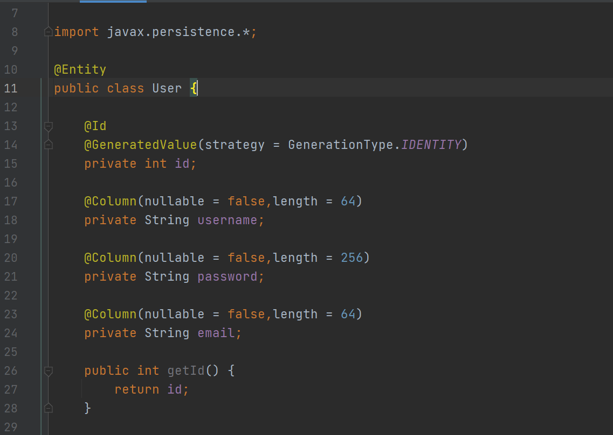

# 3.엔티티 클래스 작성 및 MySql 연동하기 

***
package com.memories.DataModel;

import lombok.AllArgsConstructor;
import lombok.Data;
import lombok.NoArgsConstructor;

import javax.persistence.*;

@Entity
public class User {

    @Id
    @GeneratedValue(strategy = GenerationType.IDENTITY)
    private int id;

    @Column(nullable = false,length = 64)
    private String username;

    @Column(nullable = false,length = 256)
    private String password;

    @Column(nullable = false,length = 64)
    private String email;

    public int getId() {
        return id;
    }

    public void setId(int id) {
        this.id = id;
    }

    public String getUsername() {
        return username;
    }

    public void setUsername(String username) {
        this.username = username;
    }

    public String getPassword() {
        return password;
    }

    public void setPassword(String password) {
        this.password = password;
    }

    public String getEmail() {
        return email;
    }

    public void setEmail(String email) {
        this.email = email;
    }
}

***