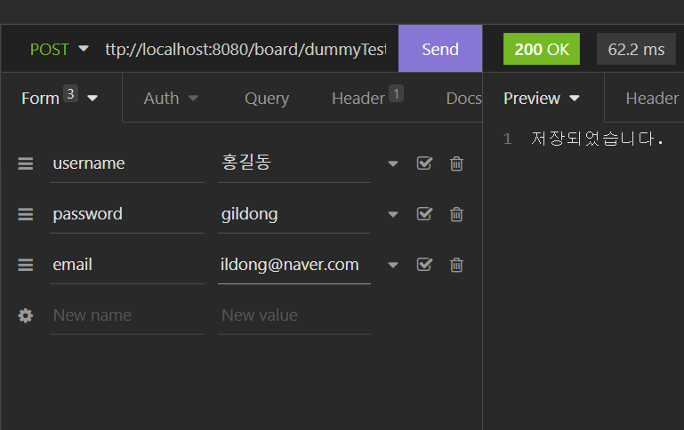
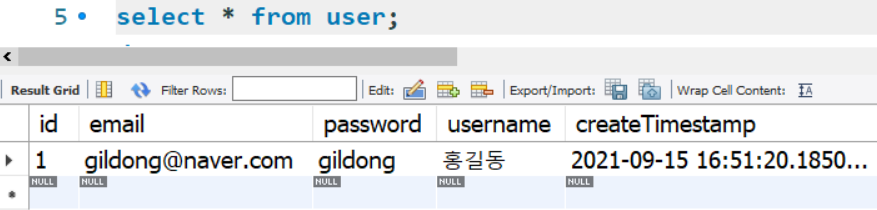
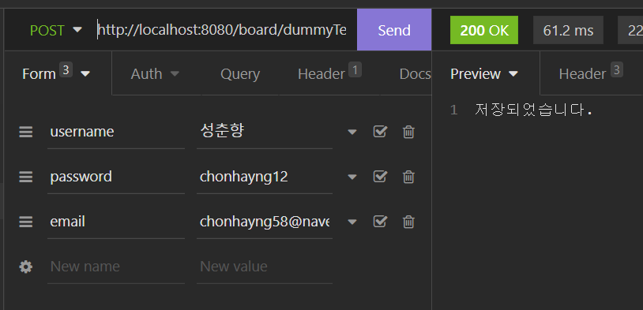
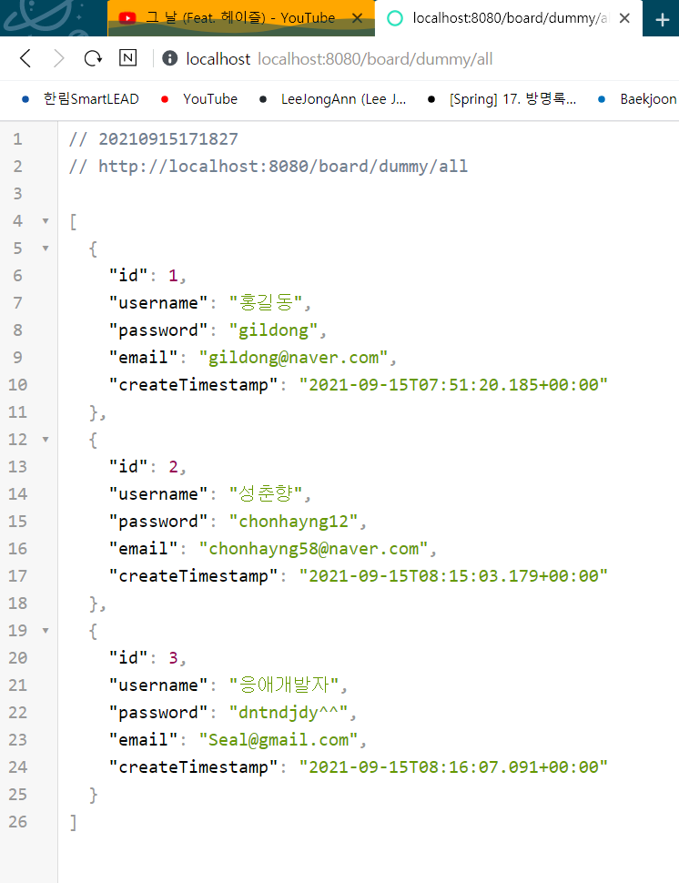
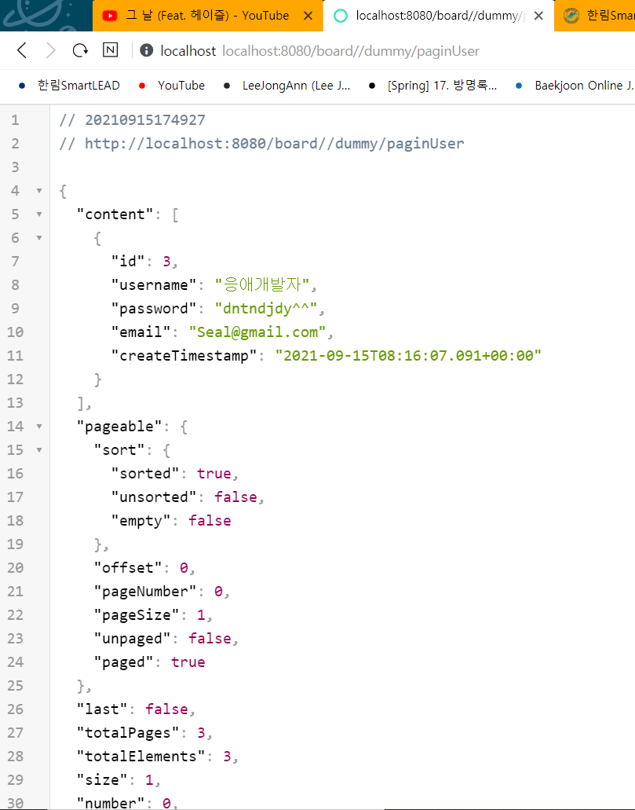
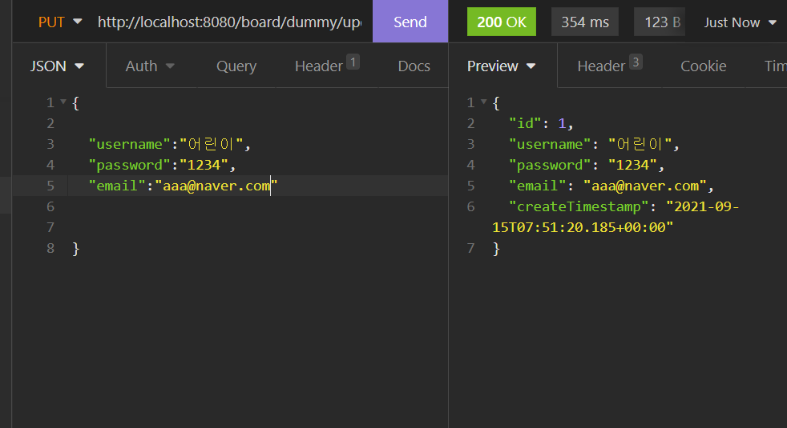
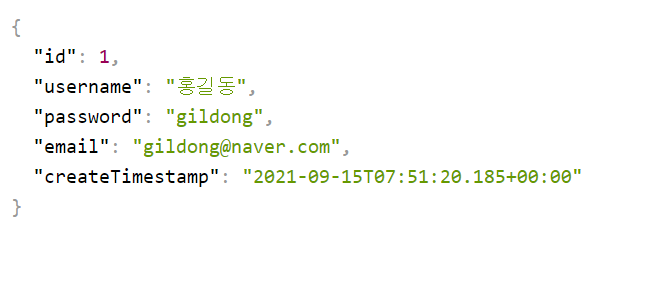
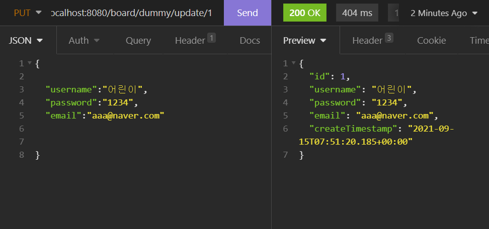
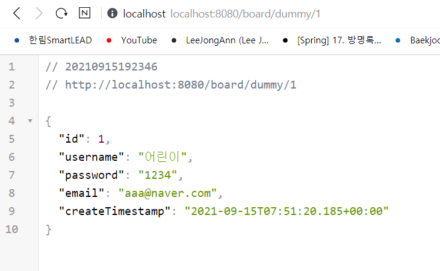

# 5. CRUD 생성 및 테스트하기 

- Insomnia라는 API테스트 툴을 사용해서 작성한 API를 테스트할 것이다.

    @PostMapping("/dummyTest") // 저장하는 메소드
    public String save(User user){
        System.out.println("사용자이름:" + user.getUsername());
        System.out.println("사용자 비밀번호:" + user.getPassword());
        System.out.println("사용자 이메일:" + user.getEmail());

        userRepository.save(user);
        return "저장되었습니다."; }

- POST 요청을 보내는 메소드로 사용자의 이름과 패스워드 이메일을 DB에 저장해준다.
- 그리고 반환값이 String이기 때문에 리턴값 역시 "저장되었습니다" 라는 문자열을 사용했다.
***
   
인섬니아를 이용해서 POST요청을 날려주면
   
위와 같이 데이터베이스에도 동일한 값이 저장되어 있는것을 확인할 수 있다.

`
사용자이름: 성춘향 사용자 비밀번호:chonhayng12 사용자 이메일:chonhayng58@naver.com   
`

 
변경하기 전에 내용은 이와 같고 인섬니아로 변경 후에는 아래와 같다. 

 
변경하는 모습 ,수정은 Put으로 해준다.

 변경 후 이와 같다.